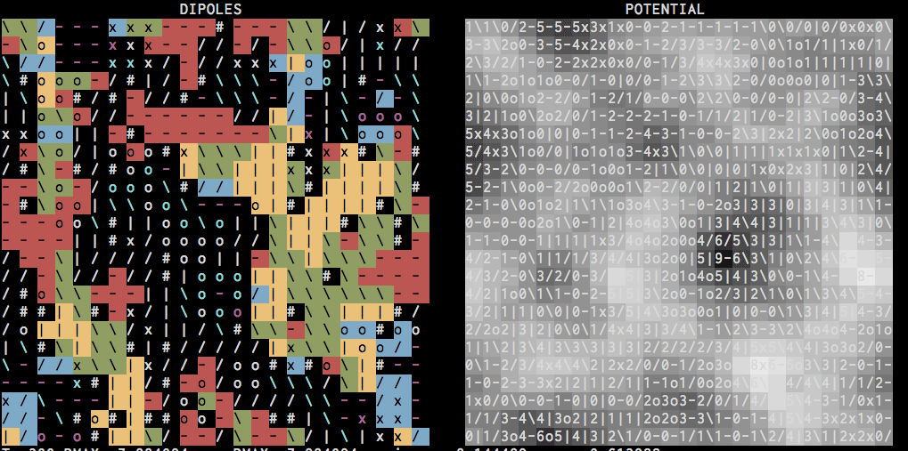

# Starry Night

Monte Carlo codes to simulate dipole-dipole interactions and ferroelectric domains in a hybrid organic-inorganic perovskite solar cell.

We have started to work on a more complete description and documentation,
available online: 

Publications
------------
- [Molecular ferroelectric contributions to anomalous hysteresis in hybrid perovskite solar cells](http://scitation.aip.org/content/aip/journal/aplmater/2/8/10.1063/1.4890246) APL Materials (2014)
- [The dynamics of methylammonium ions in hybrid organic–inorganic perovskite solar cells](http://www.nature.com/ncomms/2015/150529/ncomms8124/abs/ncomms8124.html) Nature Communications (2015)
- [Role of microstructure in the electron–hole interaction of hybrid lead halide perovskites](http://www.nature.com/nphoton/journal/v9/n10/abs/nphoton.2015.151.html) Nature Photonics (2015)

Development Notes
-----------------

2016 - Extended to 3D, solid solutions, many further analysis tools, electrostatic
potentials, Fermi-Dirac/Boltzmann hole/electron populations.

2014-05-31 - Started work on Icarius

2014-01-29
Added dependency on libconfig for lightweight config file parsing.
Mac OSX: `brew install libconfig`
Debian: `sudo apt-get install libconfig-dev`
